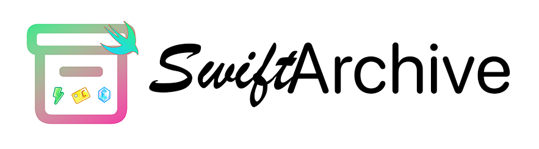

# SwiftArchive - iOS 上的 BlueArchive 剧情编辑和播放器

&nbsp;
&nbsp;
&nbsp;
&nbsp;
&nbsp;
&nbsp;
&nbsp;
&nbsp;
&nbsp;

## TODO
- [x] Momotalk 编辑器主体
- [x] Momotalk 编辑器-进阶操作
- [x] Momotalk 编辑器导出(图片)
- [ ] Momotalk 编辑器导出(视频)

## 安装
### 方案一(TestFlight) [推荐]
[Public Beta(推荐)](https://testflight.apple.com/join/JLFPR0qe)  包含较新的功能, 经过部分测试, 问题较少, 但仍可能会发生一些问题. 一般情况与 GitHub `Release` 保持同步.

[Developer Beta](https://testflight.apple.com/join/C9VEKrC8)  未经测试的所有代码更新提交, 可能会有严重崩溃甚至丢失数据的可能. 一般情况与`main`分支保持同步.
### 方案二(自签)
在GitHub项目`Release`页下载ipa并自行签名
### 方案三(自编译)
`clone`本库, 并自行在Xcode中编译
## 对于用户
### 提交反馈
如您在使用过程中遇到问题, 可先查看GitHub Release页或TestFlight中的 Release Notes.
如已知问题列表中没有您遇到的问题, 可通过以下方式提交反馈:
#### Issue
在GitHub上的`Issues`页提交一个Issue
#### TestFlight 反馈
在TestFlight中发送反馈, 在遇到已被捕获的崩溃问题时建议使用此方式
#### 注意事项
提交反馈时应清晰地写出问题的重现步骤等信息
### 提供建议
如有任何新功能建议, 同样可通过GitHub上的Issues页提出
## 对于开发者
### 代码改进
如您想帮助改进本项目的代码, 可提交`Pull Request`以帮助我们.
当然只提交`Issue`也是可以的.

帮助我们改进代码的用户将被列入**感谢名单**中
